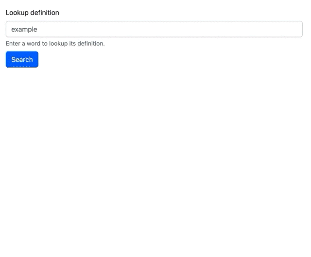

# Frontend Exercise

VoteShield Frontend Engineer job search take-home exercise.

## Instructions

Create a standalone "Word Lookup" component. This component should provide an input that looks up the definition of a word provided by an API. The following is an example, but it is not meant to be an exact specification to follow:

- Should utilize whatever API you prefer, but an easy, free one is [dictionaryapi.dev](https://dictionaryapi.dev/).
- Use whichever component framework you like, but explain any choice you make that is not popular or easily recognizable.
- Feel free to utilize a design system such as Bootstrap, but basic, reasonable design will still be assessed.
- You should not be timid about using existing tools, libraries, templates, etc, but please document any outside resources that are used that are not explicitly referenced.
- Assume this component will be used in a larger project, which implies things like it should be easily installable and include instructions.
- Please provide brief explanation of choices made throughout the project in the `README.md` or a `NOTES.md` file.
- Please see the Goals section to understand what other implicit expectations there are, and please feel free to ask questions before starting.

## Time frame

Ideally this exercise should take about about two hours. If you feel you could do more regardless of the time frame, please put information in the `README.md` or a `NOTES.md` file that briefly explains what more you would do given extra time.

## Goals

The goal of this exercise is to allow you to demonstrate not just your ability to produce high-quality, accessible, cross-device code but to show your ability to write code that fits into a larger system and used by others on a team or externally.

## Submission

You should have received explicit instructions on how to submit your work from the VoteShield hiring team.
